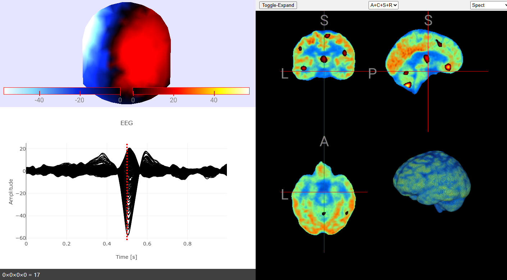

# Project
Repository for the webapp of VIDÉPÉ project of the Hackathon of the HUG 2025

VIDÉPÉ (Visualisation Intéractive des Données pour l’Évaluation Préchirurgicale de l'Épilepsie) is a web app project to enable epileptolegists to display several neuroimaging modalities (e.g. T1-weighted imaging, PET and SPECT scans) and electrophysiological recordings in a unified framework during presurgical investigation for epilepsy resective surgery.

This project was proposed for the [8th HUG Hackathon](https://www.hug.ch/centre-linnovation/hackathon-8), a 36-hour hacking marathon that took place between the 20th and 22nd of March 2025 at the Innovation Centre of the University Hospitals of Geneva (HUG).

# App Layout

# Running in local environment (Python version)
1. Open the terminal at the project root folder
2. enter `python3 -m http.server 8080`
3. go to `http://localhost:8080`

# Running in local environment (Node.js version)
1. Open the terminal at the project root folder
2. enter `npx serve -p 8080`
3. go to `http://localhost:8080`
